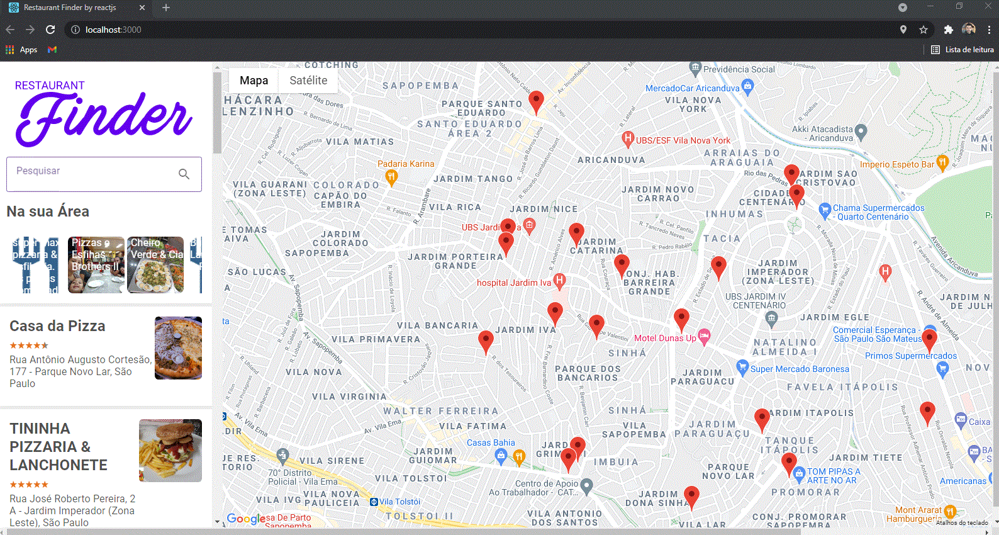
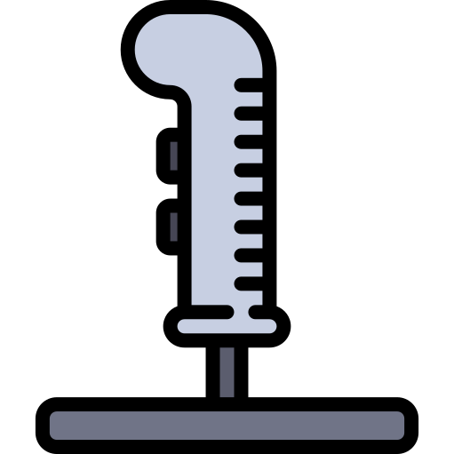

<h1 align="center">
  
   
</h1>

<h3 align="justify">
Didactic application of a restaurant search engine using reactjs, redux, consulting the google API. Credits for Advanced Bootcamp Challenge LocalizaLabs React Developer and Expert Professor Patrick Narciso of Digital Innovation One.
</h3>

 

## 📷 Demonstration

<h4 align="left"></h4>
  

 

## 🚀 Technologies

This project was developed with the following technologies:

- JavaScript ES6
- ReactJS
- useEffect
- useState
- Redux
- Slick
- Lottie
- Skeleton
- GoogleCloud

 

## ⚙ Dependencies
- yarn add styled-components
- yarn add styled-reset
- yarn add @material/react-text-field
- yarn add @material/react-material-icon
- yarn add react-slick
- yarn add slick-carousel
- yarn add react-rating-stars-component
- yarn add google-maps-react
- yarn add redux react-redux
- yarn add react-lottie

## ⚙ Installation of the dependencies
- npm i

## ⚙ Start the Server
- yarn start

## ⚙ Sources
- https://www.npmjs.com/package/styled-reset
- https://www.npmjs.com/package/@material/react-text-field
- https://github.com/material-components/material-components-web-react/tree/master/packages/text-field
- https://www.npmjs.com/package/@material/react-material-icon
- https://fonts.google.com/specimen/Roboto
- https://www.npmjs.com/package/react-slick
- https://www.npmjs.com/package/react-rating-stars-component
- https://pt-br.reactjs.org/docs/portals.html
- https://developers.google.com/maps/documentation/places/web-service/overview
- https://developers.google.com/maps/documentation/places/web-service/search
- https://developers.google.com/maps/documentation/javascript/places
- https://www.npmjs.com/package/google-maps-react
- https://github.com/fullstackreact/google-maps-react/blob/master/src/index.js
- https://www.npmjs.com/package/react-lottie
- https://lottiefiles.com/

## ⚙ To Climb Cloud
- npm run build
- https://app.netlify.com/drop

## ⚙ Test

 

Made with 💜 by Rafael Maciel
